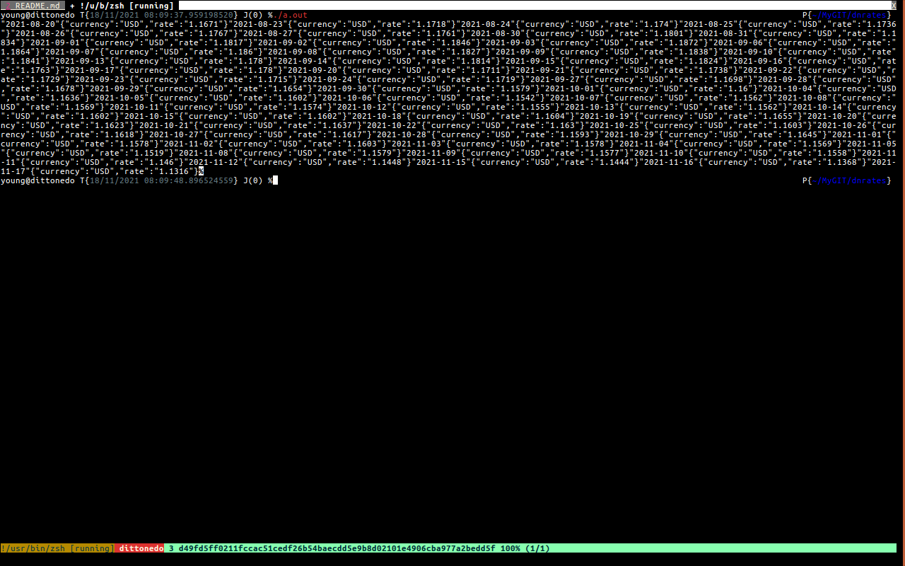

# dnrates

export ./cur\*.xml to json.

# Intentions

To deal with the stock exchange the Ditto Nedo's Way

#Compiling 
## Type, To Compile:
 gcc main.c -lxml2 -ljq

## Hence You will need:
	libxml
	libjq
### Image Example, Getting Stock Exchange history for (last 90 days)

if in the main function the `jv rates` object is:
	```
	int main ( signed Argsc, char *( Args[] ) )
	{
	 jv currencies = rt_load_json ( "currencies.xml" );
	#if 1
	 jv rates =
	     rt_get_url
	     ( "https://www.ecb.europa.eu/stats/eurofxref/eurofxref-hist-90d.xml" );
	#else

	```
	`make && ./a.out`
Else if the **main** function is like *To use the the imaginary rates file*:
	```
	int main ( signed Argsc, char *( Args[] ) )
	{
	 jv currencies = rt_load_json ( "currencies.xml" );
	#if 1
	 jv rates =
	     rt_get_url
	     ( "https://www.ecb.europa.eu/stats/eurofxref/eurofxref-hist-90d.xml" );
	#else
	 jv rates = rt_get_url ( "./rates.xml" );
	 ```
	`make && ./a.out`
Example Image:


### On My Box I Compile it Like it like,
	gcc main.c -ljq -lm /usr/lib/i386-linux-gnu/libxml2.so.2.9.3 -lavformat -lavutil

#### Rates Fetch URL 
	'https://www.ecb.europa.eu/stats/eurofxref/eurofxref-hist-90d.xml'

